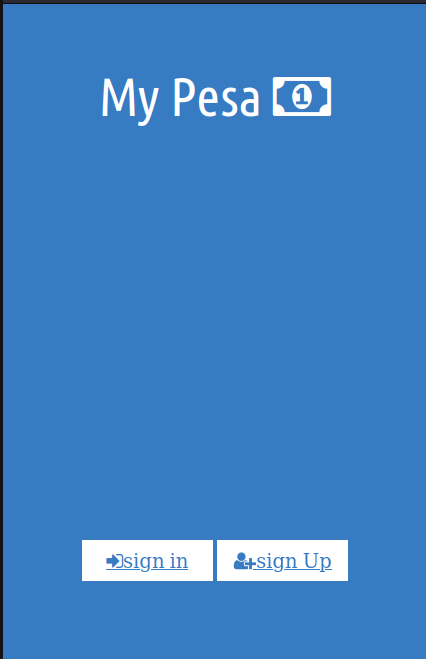
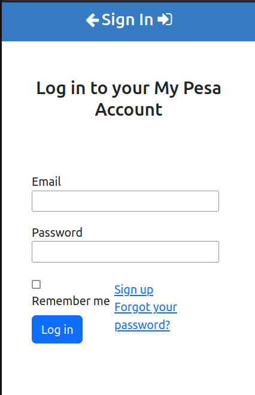
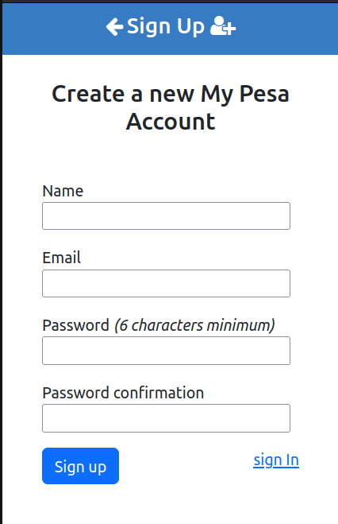
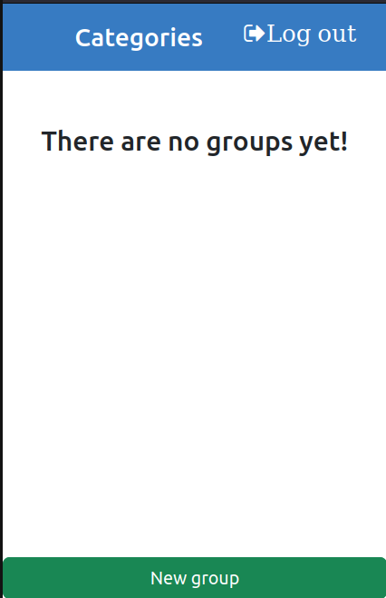
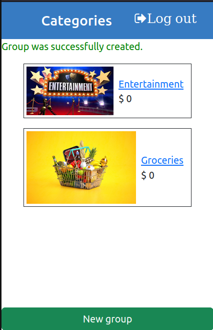
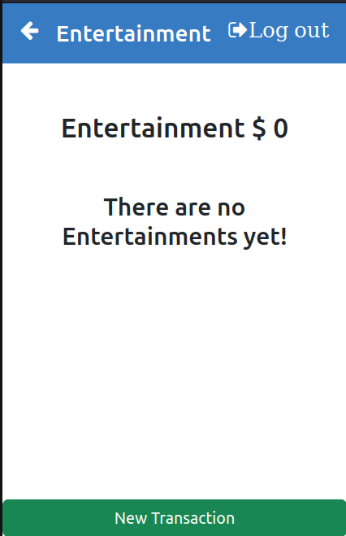

# Nemwel Budget App

My pesa is a Ruby on Rails application that aims to make the process of tracking my expenses easier. It will hopefully help you too! You will be able to create your account and have all your expenses there. 

Enjoy!

## Screenshots

# Built With
 - Ruby on Rails
 - Bootstrap 5
 - CSS3

# Live Demo
(none at the moment)

# Video Presentation
(none at the moment)

# Additional Tools
  1. Rubocop
  2. Stylelint
  3. Ruby Gems

# Getting Started
To get local copy of the project and run

1. ``git clone git@github.com:Nemwel-Boniface/nemwel_budget_app.git``
2. ``cd nemwel_budget_app``
3. ``gem install bundler``
4. ``bundle install``
5. ``rails s``

## Database Setup
Setup db

1. ``su - postgres``
2. ``psql``
3. ``create role nemwel with createdb login password 'root'``
4. ``rails db:setup``
5. ``rails db:create``

# Tests

1. ``bundle exec rspec``
2. ``rubocop``

### Run your tests

1. ``rake``
2. ``rspec``

### To run rubocop we use:

1. `rubocop`

### To autocorrect offenses with rubocop we use:
1. `rubocop --auto-correct-all` or
2. `rubocop -A`

Have fun with TDD!

## Authors

👤 **Nemwel Boniface**

- GitHub: [@Nemwel Boniface](https://github.com/Nemwel-Boniface)
- Twitter: [@Nemwel Boniface](https://twitter.com/nemwel_bonie)
- LinkedIn: [@Nemwel Bonifacej](https://www.linkedin.com/in/nemwel-nyandoro/)

## 🤝 Contributing

Contributions, issues, and feature requests are welcome!

Feel free to check the [issues page](https://github.com/Nemwel-Boniface/nemwel_budget_app/issues).

## Show your support

Give a ⭐️ if you like this project!

## Acknowledgments
- My coding partners and Morning session partners.
- Inspired by [Microverse.org](https://www.microverse.org)
- Original design by [Gregoire Vella on Behance](https://www.behance.net/gregoirevella)
- Microverse: [microverse community](https://github.com/microverseinc)

## 📝 License

This project is [MIT](./MIT.md) licensed.